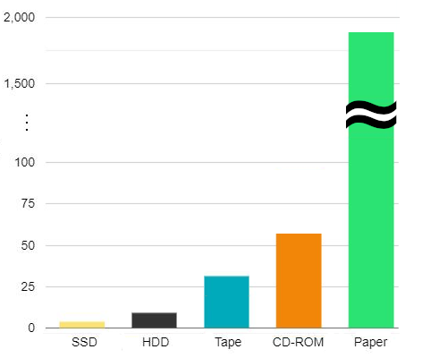
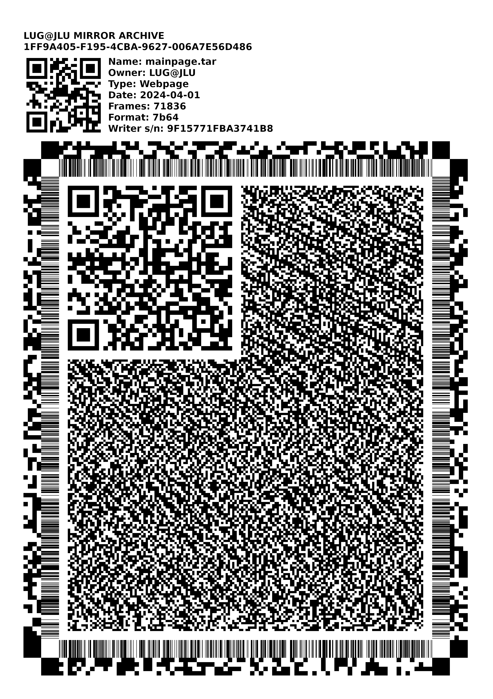
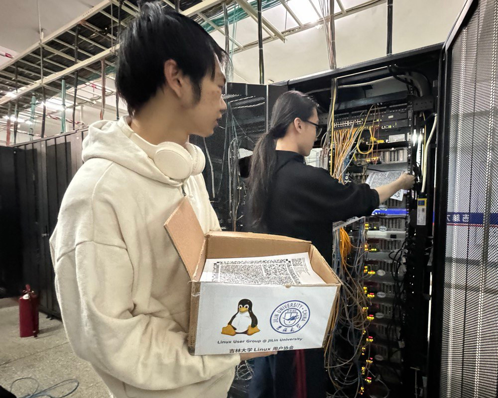

## 号外：镜像站将使用纸张备份存储库

2024 年 3 月 31 日是第 14 个[世界备份日](https://www.worldbackupday.com/cn)，吉林大学 Linux 用户协会相关同学在晚间于日新楼进行了主题小聚，暨镜像站维护小组工作会议。会议再次强调了数据备份的重要性，一致同意以纸张作为介质，备份镜像站存储库。

这项计划旨在将吉林大学开源镜像站中的全部内容进行快照，将其转化为可靠的纸质资料并永久保留。这将有助于保护我们共同的开源文化遗产。

### 为什么要对镜像站存储库进行备份？

从电脑手机到服务器，从地铁闸机到数据中心，作为现代文明一块隐藏的基石、全人类共同的智慧遗产，开源软件造就了我们生存的现代社会。

然而，当今天的代码变成千年后的历史遗迹，它或许会被未来的文明遗忘或丢失。当发生全球性的危机时，我们可能会迅速失去现代介质上的全部资料。使用不同的介质形式保存这些代码，将大大有利于其超长期保存和可访问性，以便未来的文明了解和使用今日的操作系统。

### 为什么选择使用纸张？

 图一：常见介质的寿命

在世界范围内，大量的代码都被储存在令人担忧的短期介质上，硬盘上的磁记录会在十几年内因衰落而无法读取，固态硬盘则更快，即便是保存良好的磁带和光盘，也不过能维持三五十年的时间（如图一）。2020 年，[GitHub 将特制高密度胶卷存入北极永冻土层中](https://github.blog/2020-07-16-github-archive-program-the-journey-of-the-worlds-open-source-code-to-the-arctic/)，才勉强延长保存时间至千年。

 图二：备份纸张图样

然而，考古研究发现，纸张的寿命要远远高于电子设备，有部分晋代的纸质文物仍堪阅读，其寿命至今已近两千年。在数据保存方面，纸张有着浪漫而悠久的历史，为我们留下了许多最古老的知识。纸质媒介不依赖于任何读取装置，这意味着恢复数据只需要人眼辨识图像，此外，纸张对宇宙射线不敏感、造价低廉等特征，是各种电子设备无法比拟的。因此，纸质媒介仍然是超长期存储的可靠选择。

受到 GitHub 的启发，我们也采取二维图形的方式将数据打印到 A4 纸上（如图二），这将提高数据的密度、容错和抗毁性。其中的标准 QR 码可供恢复人员快速了解恢复方法。

### 当前进展和未来计划

 图三：维护人员正在制作备份

备份数据分秒必争。4 月 1 日一早，维护人员就进入到镜像站所在的数据中心，展开纸质版快照的制作工作（如图三）。目前，我们尚在备份 `anthon` 仓库，没有进一步的 ETA ，考虑到我们只有一台 20 张/分钟的打印机，这可能需要一些时间。

由于协会经济能力有限，难以负担将这些 A4 纸送往北极长期储存的费用，待这些纸质版快照全部制作完成后，我们计划向网络中心楼上的吉林大学档案馆寻求帮助，将这些宝贵的资料长期储存在祖国的北疆。

### 结语

*“以前啊，我也有过魔法 CD 、魔法硬盘之类的，但能留到最后的，似乎只有书而已。”*

*“电子设备是会损坏的喔，和资料一起消失。”*

愿我们总是能与自由软件度过愉快的时光。

 

吉林大学 Linux 用户协会

镜像站维护小组

2024 年 4 月 1 日
